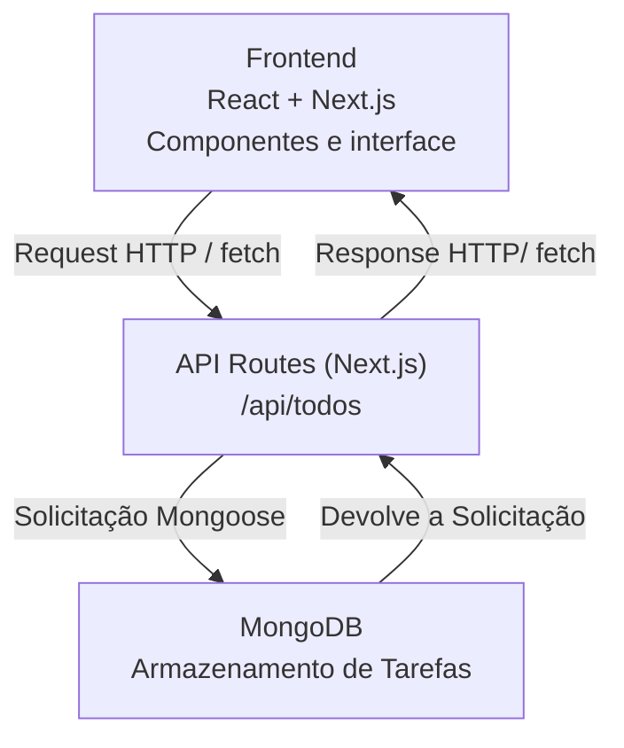

# Meu Primeiro Projeto NEXT  -  TodoList

## Introdução ao Desenvolvimento de uma aplicação To-Do com Next.js e MongoDB

## Objetivos
Aplicação de Lista de Tarefas completa, integrando o front do Next.js com backend em API Routes e o MongoDB. Consolidando ideais de arquitetura Full-Stack dentro de um mesmo framework

- criar e configurar um projeto Next.js com Typescript
- configurar a conexão com o MongoDB usando Mongoose
- criar uma modelagem de dados 
- implementar rotas de API ( Listar, Cadastrar, atualizar e excluir tarefas)
- consumir essa rotas a partir do frontEnd
- e compreender o fluxo do CRUD na aplicação

## Contextualização

A aplicação deve permitir que o Usuário:
- adicione uma nova tarefa
- visualize todas as tarefas cadastradas
- marque tarefa como concluída ou pendentes
- remova itens da lista
- tenha persistência de dados em banco

## Visão Geral da Arquitetura



## Escopo do Projeto

### FrontEnd (Next.js/React)

- exibição da lista de tarefas;
- formulário para adicionar novas tarefas;
- botão para alternar status (concluída ou pendente);
- botão para excluir tarefas;
- atualização dinâmica da interface sem recarregar a página.

### BackEnd (Next.js API Routes)

- `GET /api/todos`: retorna todas as tarefas;
- `POST /api/todos`: cria uma nova tarefa;
- `PUT /api/todos/[id]`: atualiza uma tarefa existente;
- `DELETE /api/todos/[id]`: remove uma tarefa.


### Banco de Dados (MongoDB)

- armazenamento das tarefas;
- persistência do título e do status de conclusão;
- conexão segura e reutilizável com o banco.


## Estrutura do Projeto

```text
todo-app/
|-- public/
|-- src/
|   |-- app/
|   |   |-- pages/
|   |   |-- componentes/
|   |   |-- model/
``` 

## Dependências 

npm install mongoose
> permite conectar a aplicação ao MongoDB, definir Modelos para os dados e realizar operações do CRUD

npm install -D @types/react @types/node
> adiciona definições para o Typescript  dos componenetes react e node

